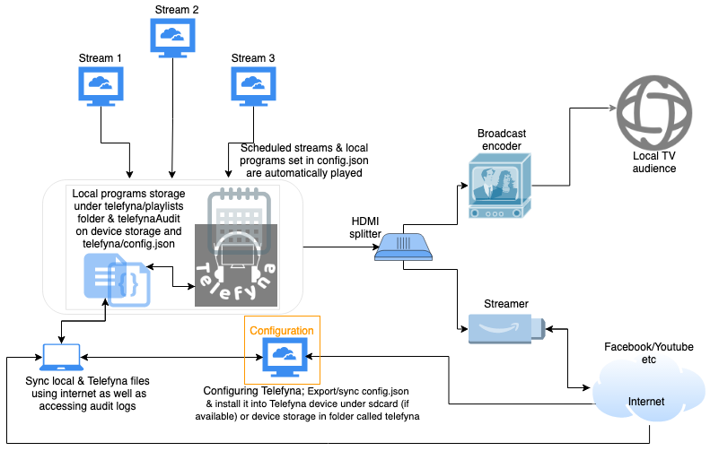

# Telefyna
The best simplest performing online stream & local file scheduling auto player for TV broadcasting.
______

## Infrastructure/Demo

## Installation
* Download the [APK from here](https://github.com/avventoapps/avvento/releases/latest/download/telefyna.apk) and install it, grant the app Storage permission and reload it if necessary

## Configurations
* User the [online configuration application](https://avventomedia.org/telefyna/configuration.html) to build and export your `config.json`
* Visit SDcard/drive or device storage without SDcard/drive and add a local `telefyna` folder playlist folder containing your local programs folder (`playlist`) and `config.json` file
* Ensure the telefyna app is granted storage permission in your permissions
* Telefyna logs audits onto `telefynaAudit` on the device storage
* Maintenance automatically runs at midnight each day and schedules programs for the starting day
* To tell Telefyna to reload any time you need to add `init.txt` file in `telefynaAudit` folder and it will reload on next program
* A started slot can't be updated even if you change programs, or schedule. changes can only affect the next schedule and following

### Device
* set `notificationsDisabled` to false to disable notifications
* set `automationDisabled` to true to disable and only use the first playlist

### Remote access
* If you want to access the filesystem remove, run an [FTP app like swiftp](https://github.com/avventoapps/avvento/releases/latest/download/swiftp.apk)
* You can use FTP clients like [FileZilla](https://filezilla-project.org/) to upload both revised `config.json` and `playlist` folder/contents
* Alternatively you can auto sync local to device folder with something like [drivesync](https://github.com/avventoapps/avvento/releases/download/1.0/drivesync.apk)
* You can do the same `telefynaAudit` folder which is the internal device storage root path

### Playlist
* Ensure the device's Date and Timezone are set correctly
* The first playlist is the default  playlist and is used as a filler if nothing is available to play next or local folder is vacant
* The second playlist is a second default, it's a second filler choice and is played when `ONLINE` ones fail because of of internet issues
* If an internet connection is lost during a broadcast, the second playlist is defaulted to and if it's restored, the previous program will be restored too
* Both the above two default playlists must be maintained active, if any of them is local, better set resuming
* If you intend to use one playlist as default for both the first and second, make the second a schedule of the first
* `name` your playlist meaningfully
* `description` contains your explanation of about the playlist
* `days` of the week (`1-7`=Sun-Sat): if null or not defined, runs daily
* `dates` to schedule playlist for, date format must be `dd-MM-yyyy`
* Playlist `start` should be in format `HH:mm` eg `12:00` for mid-day, hours are in 24 hour
* `urlOrFolder`, stream url or local folder containing alphabetically ordered playlist folders
* For local playlists, if active and nothing is defined or completed, the default playlist will be played
* `type` can either be `ONLINE` (stream/default), or `LOCAL_SEQUENCED` (local ordered folder) or `LOCAL_RESUMING` (local resuming folder), or `LOCAL_RESUMING_SAME` (local resuming from same non completed program), or `LOCAL_RESUMING_NEXT` (local resuming from next program) or `LOCAL_RANDOMIZED` (local random folder)
* For `type`s `LOCAL_SEQUENCED`, `LOCAL_RANDOMIZED`
* Each playlist can load bumpers from 3 or less folders listed below
* You can define bumpers (ads, promos etc) to play as the `LOCAL_SEQUENCED` or `LOCAL_RANDOMIZED` playlist starts in `bumper` folder in a sub folder named same value as your playlist's `urlOrFolder`
* You can add folder named after `specialBumperFolder` value to tag any playlist to play bumpers located in `specialBumperFolder` folder 
* You can add `General` folder in `bumper` folder for general ads to play before all bumpers & programs
* All playlist are enabled by default, to disable one, set `active=false`
* `schedule` allows you to schedule a playlist defined up by its order/number/count (starts from 0) and manage separate/override `start` or `days` or `dates`
* A field left out in config is by default set to `null`
* Ensure to have a playlist completing/ending each local one else the default one will automatically be played

## Support
For any questions or queries, please email the support team at apps@avventohome.org

## TODO
- [ ] redo demo
- [ ] create user-guide
- [ ] ticker close after a loop?
- [ ] replay fillers if gone
- [ ] support triggering reinitialization on next program.
- [ ] support logo, lowerthirds etc: https://github.com/google/ExoPlayer/issues/8648 | https://exoplayer.dev/ui-components.html#customization
- [ ] SRT support: https://github.com/google/ExoPlayer/issues/8647
- [ ] support auto installing of config under resources if non exists at first run
- [ ] make Telefyna device specific, mantain a file with device ids supported and at running if the device isn't granted show video demo to help them get in touch at mail@avventohome.org
- [ ] investigate playning slot at 20:57. it played from start
- [ ] Create a telefyna LOCAL_RANDOMIZED special which loads folders and plays one at a time or set logic for it
- [ ] test dates down the playlist if it overwrites the schedule
- [ ] Test playlist modification etc
- [ ] test and fix mid night runner
- [ ] Test setupLocalPrograms: addedFirstItem
- [ ] handle current play at switch not buffering video
- [ ] Add stop or change audit event
- [ ] log every keypress
- [ ] fix app relaunching openning a new/duplicate rather than resuming
- [ ] fix swift bug, don't override, just replace (hack, skip by default, delete copy again) manually files
- [ ] player plays another in the background sometimes
- [ ] investigate bumpers missing when loaded from scheduler
- [ ] handle player idling on stream, resume the play/seekTo
- [ ] some source error unknown makes the program to switch, retry defaulting back to the program
links
- [ ] support youtube links and streams
- [ ] add fading mechanisms than cut
- [ ] look through TODOs
- [ ] locally backup/download streaming content
- [ ] Build schedule GUI builder & viewer for the `config.json`
- [ ] build reports from audits
- [ ] write tests
- [ ] play video with different or additional audio/slave
- [ ] float another layer on video stream for ads, logo etc
- [ ] read satellite channels and decoders as we do local playlists and streams
- [ ] add a way to stream video as only audio, only streaming audio
- [ ] support streaming to hls, shoutcast & loudcast (not supported); use external streaming encoder
- [ ] ensure all wrong media files are skipped (blocked)
- [ ] work on presentation approach (blocked)
- [ ] support more formats such as SRT
- [x] rename clone with schedule
- [x] add promos/sweepers/something folder that starts the playout whether in continuing. usable for upnexts: intros folder containing another named by foldername: test symbolic 
- [x] Schedule once per start (last), ignore the rest of the slots
- [x] Network listener, switches to second default when internet is off, and back if slot still active
- [x] Add continuing not by seekto `LOCAL_RESUMING_NEXT`
- [x] Fork and add auto start using system prefs to FTP, send [PR](https://github.com/ppareit/swiftp/pull/163)
- [x] support audit logs, mail them out
- [x] work on now playing orm(system preferences) to handle resuming local playlists at next play to support daily etc periods and future dates
- [x] add dates in addition to days
- [x] remove repeats, use days for day
- [x] reload configurations at midnight
- [x] default back to first playlist if the local playlist completes before end time
- [x] Fix com.google.android.exoplayer2.source.BehindLiveWindowException on hls streaming
- [x] fix playlist pending extra being null in broadcast
- [x] Play folder
- [x] Fix scheduling
- [x] hide exoplayer buttons
- [x] exoplayer switching to another track smoothly/Smooth switching
- [x] Support resuming from last played in playlist folder to next